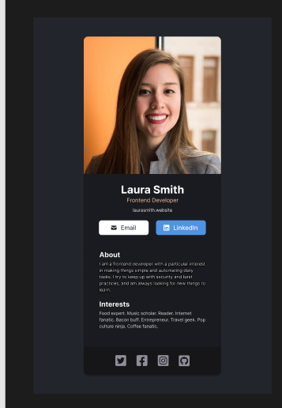

# React Course Challenge - Card

# 🚀 Software Business Card Generator

Every developer needs a business card for their professional endeavors, but why settle for paper when you can have a digital presence? Introducing the Software Business Card Generator – a project that allows you to build your own business card with a touch of code and creativity.

## Features

✨ **Customization**: Personalize your business card with your unique touch. Choose colors, fonts, and styles that represent you.

👨‍💻 **Developer Friendly**: Built by developers, for developers. The project is designed to be easy to use and customizable with coding in mind.

🔧 **Flexibility**: Adapt the business card to your needs. Showcase your skills, link to your projects, and provide multiple contact options.

## Demo

## 🛠 Skills

HTML, CSS, Git, GitHub, Javascript...

## 🔗 Links

## Authors

- [@mostafa-m-desouky](https://github.com/mostafa-m-desouky)
